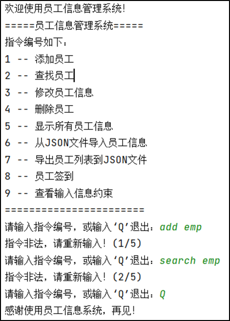

# 员工信息管理系统
本项目是一个使用原生python语言开发的命令行工具
> 注：本项目自2024.4.25停止维护，源代码仅供参考
## 快速开始

### 配置要求
本地需要有python运行环境，且解释器版本为3.10及以上

### 安装步骤
1. 将本项目源代码下载到本地
2. 安装项目依赖
   ```bash
   pip install -r requirements.txt
   ```
3. 配置云端数据库信息
   在项目目录下新建文件`config.yaml`并在文件中配置需要连接的数据库选项，例：
   ```yaml
   # config.yaml
   charset: utf8mb4 # 编码格式
   host: [[your_server_ip_address]]
   port: [[your_sql_port]]
   user: [[your_username_for_connecting_sql]]
   password: [[your_password_for_connecting_sql]]
   database: [[your_database]]
   ```
4. 测试连通性
   ```bash
   python -m unittest test_sql_controller.py
   ```
   如果测试通过，则证明连接成功
5. 执行入口脚本
   ```bash
   python main.py
   ```
6. 根据提示操作<br>
   

## 文件目录说明
```tree
├── data
│     └── result.json
├── src
│     └── test.json
├── emp_list
├── HRM_system.py
├── SQL_controller.py
├── main.py
├── test.py
└── mock_script.py
```
- data：文件夹，一般规定存放导出的json文件。
- src：文件夹，一般规定存放导入的json文件。
- emp_list.py: 定义员工列表管理类，实现员工的增删改查方法。
- employee.py: 实现员工的各项信息约束审核，以及员工字典的构造。
- HRM_system.py: 定义交互控制台类，实现了与用户的直接进行交互，并将信息传至emp_list管理类。
- SQL_controller.py: 定义数据库管理类，实现了数据库中员工信息的增删改查功能。
- main.py: 项目入口。
- test.py: 测试文件。
- mock_script.py: 开发者脚本，用于将在线mock的json数据写入本地json文件中辅助测试。
> 2024.4.25 该在线mock地址已失效

## 作者
BUAAkang, aka Litang Lynx
Wechat: kyx18234267050

## 版权说明
该项目签署了MIT版权许可，详情参阅 LICENSE